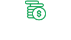
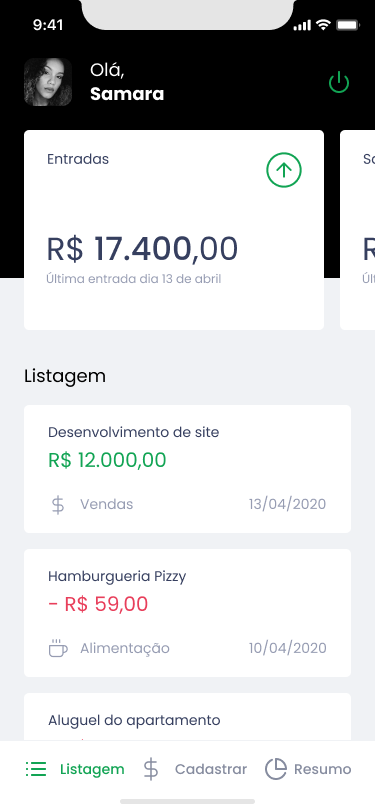
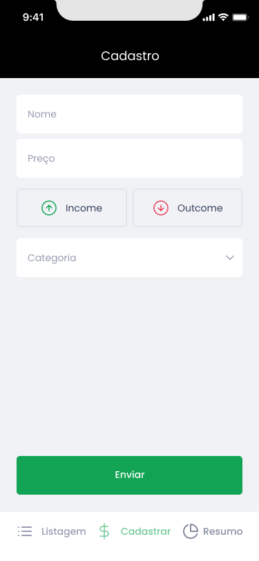
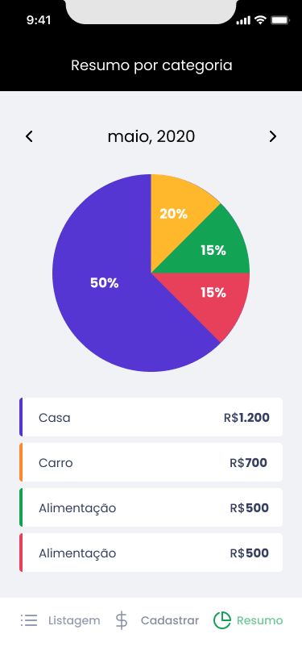

<h2 align="center">
	
</h2>

## 💻 Sobre o projeto

O Gofinances foi desenvolvido durante a trilha de React Native no Ignite da Rocketeseat. O projeto é baseado em um app de controle de fincanças pessoais onde foi aplicado diversos conhecimentos.

## 🛠 Tecnologias

Algumas das ferramentas que foram usadas na construção do projeto:

- [Expo][expo]
- [TypeScript][typescript]
- [VitoryNative][victorynative]
- [StyledComponents][styledcomponents]

## 🎨 Layout

  
  
  
  

Feito com ❤️ Samara Carvalho 👋🏽 [Entre em contato!](https://www.linkedin.com/in/samcarvalhos/)

[expo]: https://docs.expo.dev/
[typescript]: https://www.typescriptlang.org/
[victorynative]: https://www.npmjs.com/package/victory-native
[styledcomponents]: https://styled-components.com/
